## Simplified System Architecture

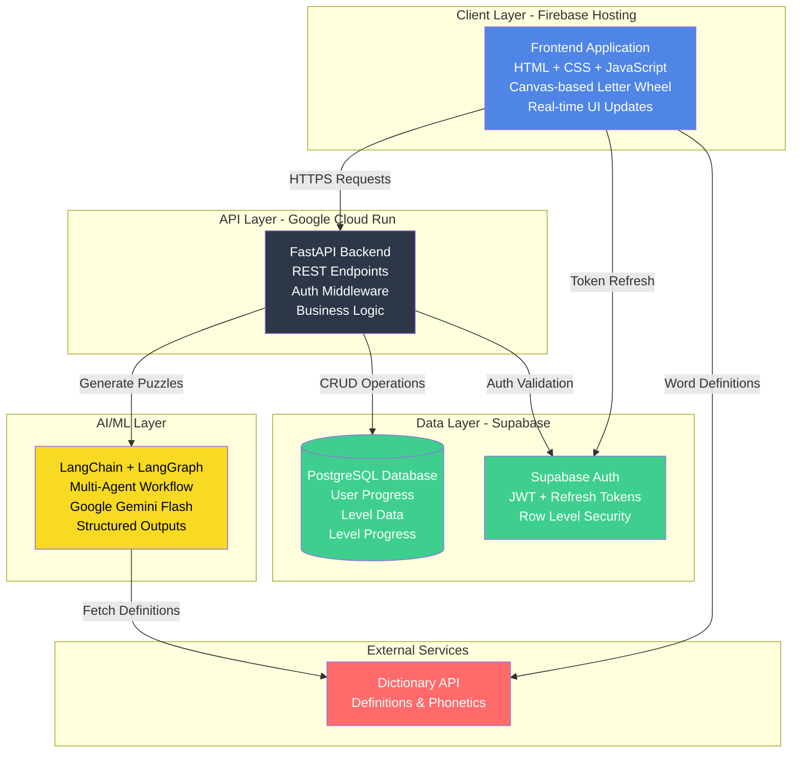

## Database Layer Architecture

### Database Models & Operations

```mermaid
graph TB
    subgraph "Database Models - db/"
        subgraph "level_data.py"
            LD_MODEL[LevelData Model<br/>━━━━━━━━━━<br/>level_id: str<br/>level_number: int<br/>base_word: str<br/>word_list: list<br/>target_words: list<br/>sentence: str<br/>final_sentence: str<br/>improved_count: int<br/>critc_verdict: str<br/>critc_verdict_reason: str<br/>explanation_deck: Optional]
            
            LD_STORE[store_level<br/>Insert new level]
            LD_GET_IDS[get_level_ids_for_level<br/>Fetch IDs by level number<br/>Filter: critc_verdict=PASSED<br/>Optional: exclude_id]
            LD_FETCH[fetch_level<br/>Get level by ID]
            LD_REPORT[report_level<br/>Mark as FAILED<br/>Append USER REPORTED]
        end
        
        subgraph "user.py"
            UP_MODEL[UserProgress Model<br/>━━━━━━━━━━<br/>user_id: str<br/>current_level: int<br/>level_id: str<br/>total_coins: int<br/>hints_remaining: int]
            
            UP_CREATE[create_user_progress<br/>Initialize new user<br/>Set level=1, coins=1000<br/>hints=3]
            UP_GET[get_user_progress<br/>Fetch user stats]
            UP_UPDATE[update_user_progress<br/>Save progress]
            UP_HINT[update_hint_remaining<br/>Decrement hints]
        end
        
        subgraph "level_progress.py"
            LP_MODEL[LevelProgress Model<br/>━━━━━━━━━━<br/>user_id: str<br/>level_number: int<br/>level_id: str<br/>found_words: list<br/>bonus_words: list<br/>is_completed: bool<br/>completed_at: str]
            
            LP_UPDATE[update_level_progress<br/>Upsert on conflict<br/>Keys: user_id + level_number]
            LP_GET[get_level_progress<br/>Fetch specific level state]
        end
        
        subgraph "table_names.py"
            TBL_NAMES[Tables Class<br/>━━━━━━━━━━<br/>user_progress<br/>level_progress<br/>level_data<br/>word_timestamps]
        end
    end
    
    subgraph "Supabase PostgreSQL"
        TBL_USER[user_progress Table<br/>━━━━━━━━━━<br/>PK: user_id<br/>Tracks: coins, hints, current level]
        
        TBL_LEVEL_PROG[level_progress Table<br/>━━━━━━━━━━<br/>PK: user_id + level_id<br/>Tracks: found/bonus words<br/>completion status]
        
        TBL_LEVEL_DATA[level_data Table<br/>━━━━━━━━━━<br/>PK: level_id<br/>Stores: puzzles, sentences<br/>verdict, explanation deck]
        
        TBL_TIMESTAMPS[word_timestamps Table<br/>━━━━━━━━━━<br/>Analytics: word discovery times]
        
        RLS[Row Level Security<br/>auth.uid policies]
    end
    
    subgraph "API Endpoints - main.py"
        EP_GEN["/generate_level/level"]
        EP_FETCH["/fetch_level/level_id"]
        EP_DEMO["/demo_level"]
        EP_REPORT["/report_level/level_id"]
        EP_USER_GET["/user/progress GET"]
        EP_USER_POST["/user/progress POST"]
    end
    
    %% LevelData connections
    LD_MODEL --> LD_STORE
    LD_MODEL --> LD_GET_IDS
    LD_MODEL --> LD_FETCH
    LD_MODEL --> LD_REPORT
    
    LD_STORE --> TBL_LEVEL_DATA
    LD_GET_IDS --> TBL_LEVEL_DATA
    LD_FETCH --> TBL_LEVEL_DATA
    LD_REPORT --> TBL_LEVEL_DATA
    
    %% UserProgress connections
    UP_MODEL --> UP_CREATE
    UP_MODEL --> UP_GET
    UP_MODEL --> UP_UPDATE
    UP_MODEL --> UP_HINT
    
    UP_CREATE --> TBL_USER
    UP_GET --> TBL_USER
    UP_UPDATE --> TBL_USER
    UP_HINT --> TBL_USER
    
    %% LevelProgress connections
    LP_MODEL --> LP_UPDATE
    LP_MODEL --> LP_GET
    
    LP_UPDATE --> TBL_LEVEL_PROG
    LP_GET --> TBL_LEVEL_PROG
    
    %% Table names reference
    TBL_NAMES -.->|References| TBL_USER
    TBL_NAMES -.->|References| TBL_LEVEL_PROG
    TBL_NAMES -.->|References| TBL_LEVEL_DATA
    TBL_NAMES -.->|References| TBL_TIMESTAMPS
    
    %% API to Model connections
    EP_GEN --> LD_GET_IDS
    EP_GEN --> LD_STORE
    EP_FETCH --> LD_FETCH
    EP_DEMO --> LD_GET_IDS
    EP_DEMO --> LD_FETCH
    EP_REPORT --> LD_REPORT
    
    EP_USER_GET --> UP_GET
    EP_USER_GET --> LP_GET
    EP_USER_POST --> UP_UPDATE
    EP_USER_POST --> LP_UPDATE
    
    %% RLS protection
    TBL_USER -.->|Protected by| RLS
    TBL_LEVEL_PROG -.->|Protected by| RLS
    
    style LD_MODEL fill:#3b82f6,color:#fff
    style UP_MODEL fill:#8b5cf6,color:#fff
    style LP_MODEL fill:#ec4899,color:#fff
    style TBL_NAMES fill:#64748b,color:#fff
    style TBL_USER fill:#3ecf8e,color:#fff
    style TBL_LEVEL_PROG fill:#3ecf8e,color:#fff
    style TBL_LEVEL_DATA fill:#3ecf8e,color:#fff
    style RLS fill:#f59e0b,color:#fff
```

### Database Operations Flow

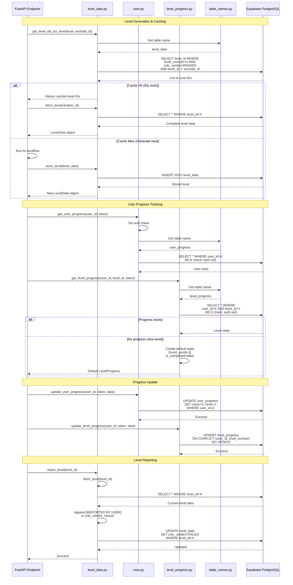

## AI Agent Workflow Architecture

### Multi-Agent Puzzle Generation System

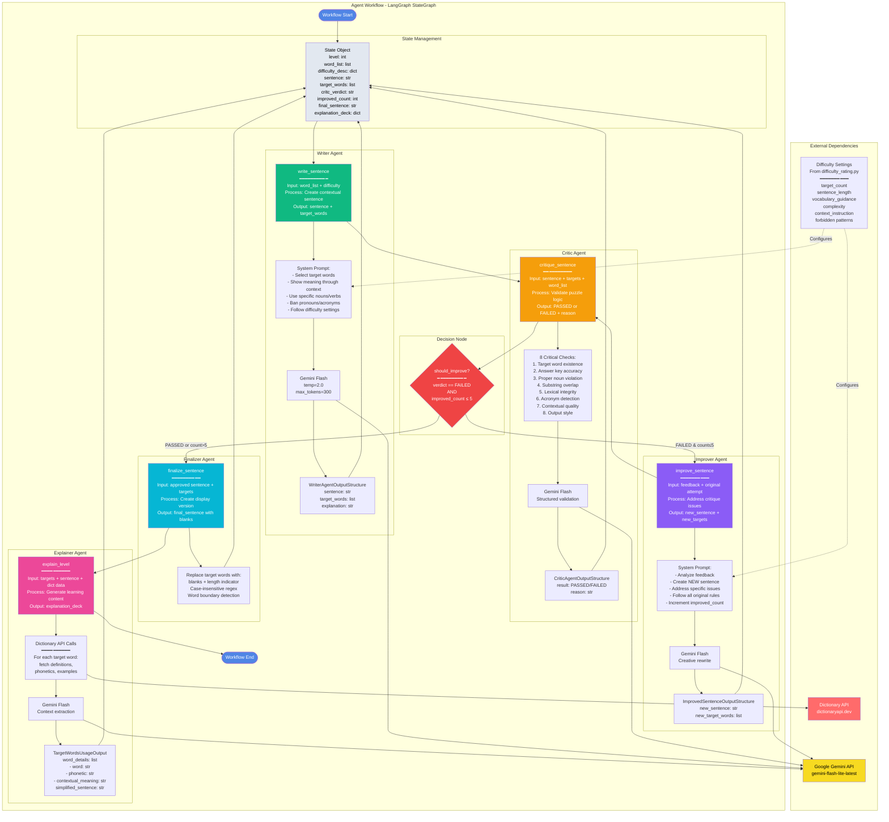

### Agent Workflow Execution Flow

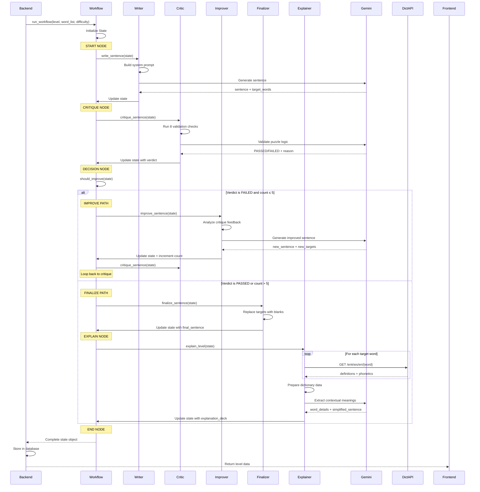

### Workflow State Transitions

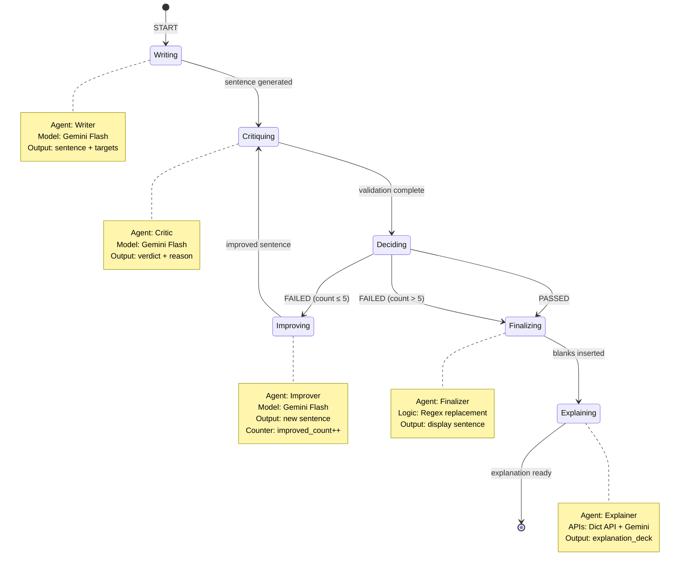

### Agent Responsibilities & Constraints

|Agent|Primary Goal|Input|Output|Constraints|
|---|---|---|---|---|
|**Writer**|Create educational puzzle sentence|word_list, difficulty_desc|sentence, target_words, explanation|Must use SHOW DON'T TELL principle, no acronyms, no pronouns as targets|
|**Critic**|Validate puzzle quality & correctness|sentence, target_words, word_list|result (PASSED/FAILED), reason|8 critical checks must all pass|
|**Improver**|Fix failed sentences|critique_feedback, original_sentence|new_sentence, new_target_words|Max 5 improvement cycles, must address specific feedback|
|**Finalizer**|Create display version|approved sentence, target_words|final_sentence with blanks|Case-insensitive, word boundary aware|
|**Explainer**|Generate learning content|target_words, sentence, dict_data|word_details, simplified_sentence|Context-specific definitions, phonetics|

### Difficulty Configuration Impact

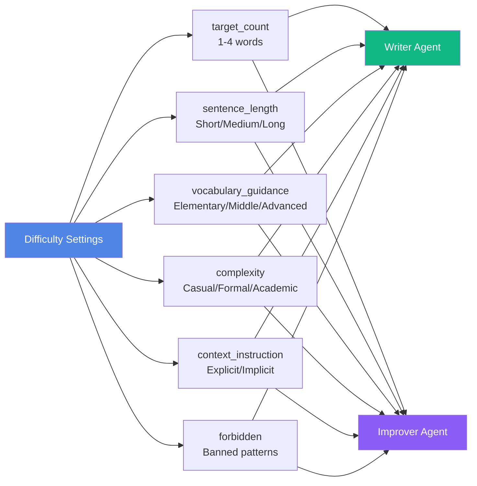

## Core Feature Flows

### 1. User Authentication Flow

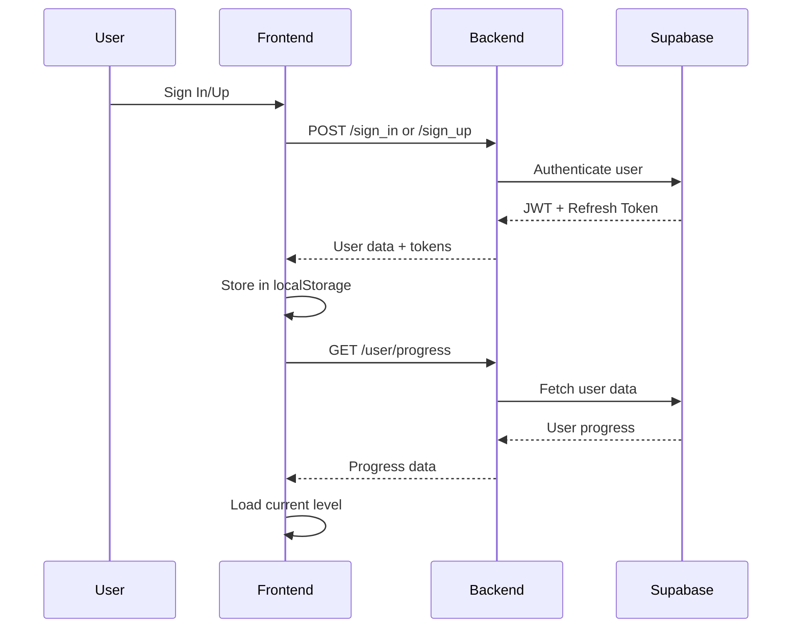

### 2. Level Generation Flow

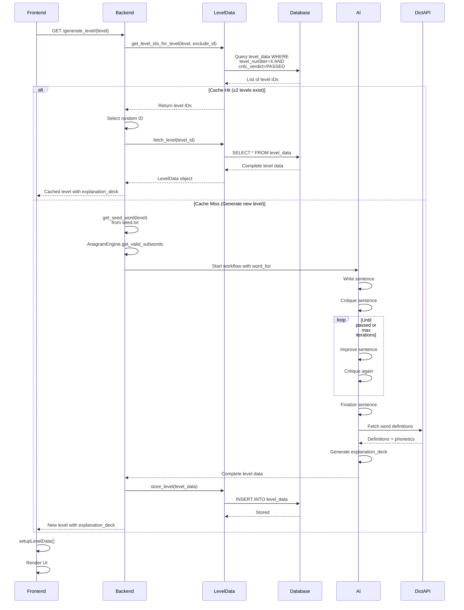

### 3. Gameplay Loop

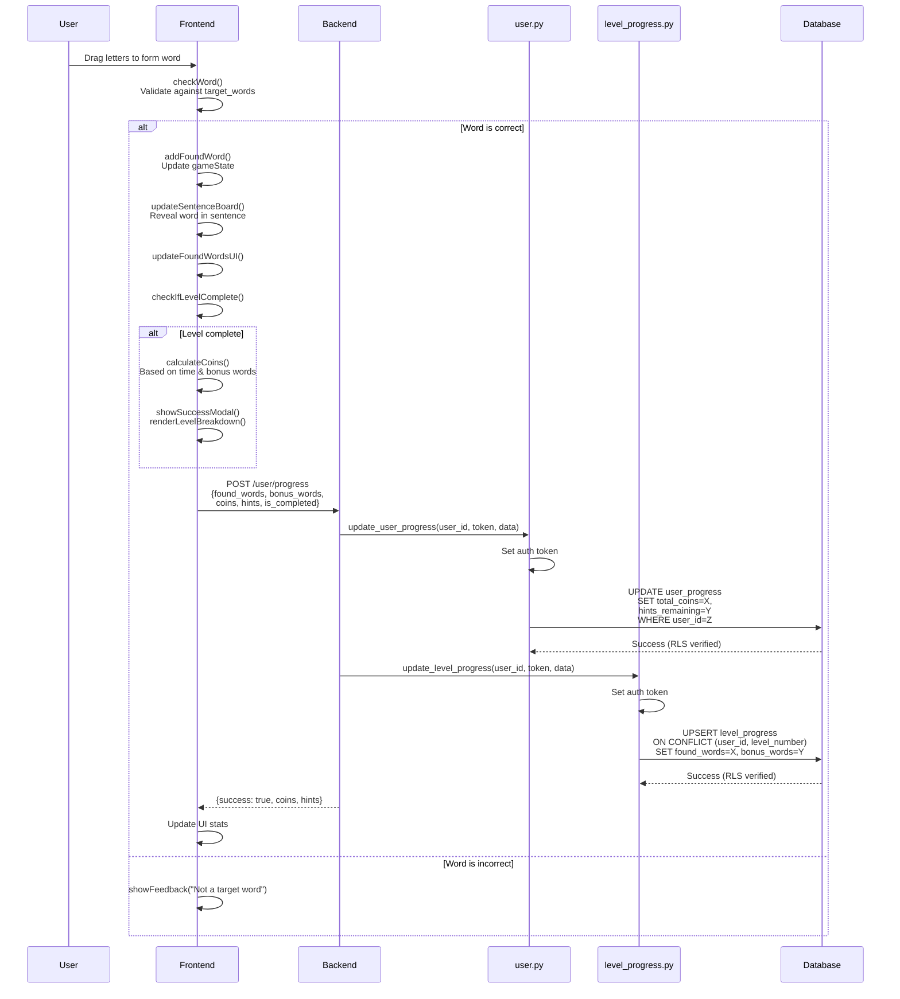

### 4. Token Refresh Fallback

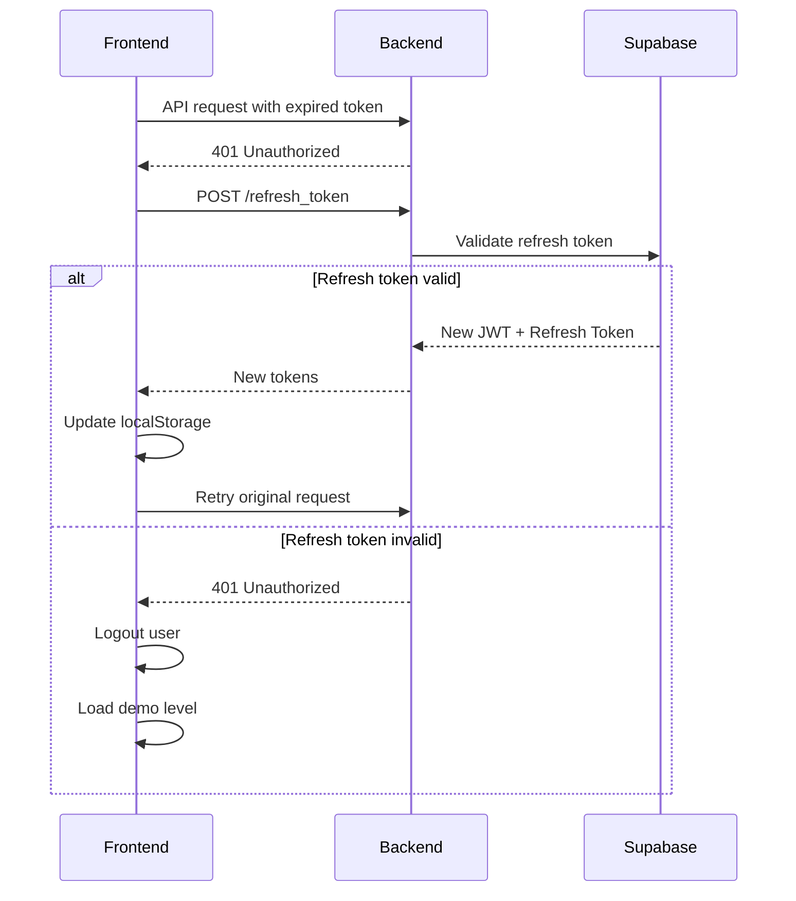

## Tech Stack Summary

|Layer|Technologies|Purpose|
|---|---|---|
|**Frontend**|HTML5, CSS3 (Tailwind), Vanilla JavaScript, Canvas API|Interactive game interface, letter wheel, drag & drop|
|**Backend**|Python FastAPI, Uvicorn, Pydantic|REST API, request validation, business logic|
|**AI/ML**|LangChain, LangGraph, Google Gemini Flash|Multi-agent workflow for puzzle generation & validation|
|**Database**|Supabase (PostgreSQL), Row Level Security|User data, level cache, progress tracking|
|**Auth**|Supabase Auth, JWT, Refresh Tokens|Secure authentication with token rotation|
|**Hosting**|Firebase Hosting (Frontend), Google Cloud Run (Backend)|Global CDN, serverless containerized backend|
|**External**|Dictionary API (dictionaryapi.dev)|Word definitions, phonetics, audio|

## Key Design Patterns

1. **Fallback Mechanisms**
    
    - Token expiry → Automatic refresh
    - No user session → Demo level mode
    - Missing level data → Generate on-demand
    - DB connection issues → Cached responses
2. **State Management**
    
    - Frontend: JavaScript objects (`gameState`, `userState`)
    - Backend: Stateless API with session validation
    - Database: Normalized tables with foreign keys
3. **Database Layer Pattern**
    
    - **Model Files**: Each table has dedicated Pydantic model class
        - `level_data.py` - Level generation and caching
        - `user.py` - User progress and statistics
        - `level_progress.py` - Per-level completion tracking
    - **Centralized Table Names**: `table_names.py` as single source of truth
    - **Smart Caching**: `get_level_ids_for_level()` filters by verdict=PASSED
    - **UPSERT Pattern**: `level_progress.py` uses conflict resolution
    - **Auth Injection**: All user operations pass token for RLS
    - **Lazy Generation**: Create levels only when cache has <2 items
    - **Quality Control**: `report_level()` removes bad puzzles from pool
4. **Security Layers**
    
    - HTTPS only
    - JWT authentication
    - Refresh token rotation
    - Row Level Security (RLS) in database
    - CORS configuration
5. **Performance Optimizations**
    
    - Level caching in database (reduces AI generation calls)
    - Lazy loading of definitions
    - Canvas rendering optimization
    - Anagram pre-computation
    - UPSERT prevents duplicate inserts

## Data Models

### Frontend State

```javascript
gameState = {
    baseWord: String,
    scrambledLetters: Array,
    targetWords: Array,
    allValidWords: Array,
    foundWords: Array,
    bonusWords: Array,
    fullSentence: String,
    sentenceRaw: String,
    explanationDeck: Object
}

userState = {
    isLoggedIn: Boolean,
    authToken: String,
    coins: Number,
    hintsRemaining: Number,
    currentLevel: Number,
    levelId: String
}
```

### Database Schema

```
user_progress (managed by user.py)
├── user_id (PK) - UUID from Supabase Auth
├── current_level - int (default: 1)
├── level_id - str (current puzzle ID)
├── total_coins - int (default: 1000)
└── hints_remaining - int (default: 3)
Operations: create_user_progress, get_user_progress, update_user_progress

level_progress (managed by level_progress.py)
├── user_id (PK) - UUID from Supabase Auth
├── level_id (PK) - UUID of specific puzzle
├── level_number - int
├── found_words - JSON array
├── bonus_words - JSON array
├── is_completed - boolean (default: false)
└── completed_at - timestamp (nullable)
Operations: update_level_progress (UPSERT on conflict)

level_data (managed by level_data.py)
├── level_id (PK) - UUID
├── level_number - int
├── base_word - str (seed word)
├── word_list - JSON array (all valid anagrams)
├── target_words - JSON array (answer key)
├── sentence - str (original sentence)
├── final_sentence - str (with blanks)
├── improved_count - int (AI revision cycles)
├── critc_verdict - str (PASSED/FAILED)
├── critc_verdict_reason - str
└── explanation_deck - JSON (nullable, TargetWordsUsageAgentOutputStructure)
Operations: store_level, get_level_ids_for_level, fetch_level, report_level

word_timestamps (referenced in table_names.py)
└── Analytics table for tracking word discovery times

Table names centralized in table_names.py:
- Tables.user_progress
- Tables.level_progress
- Tables.level_data
- Tables.word_timestamps
```

### Key Database Features

1. **Level Caching Strategy** (level_data.py)
    
    - `get_level_ids_for_level()` only returns PASSED levels
    - Filters out reported/failed levels automatically
    - Supports `exclude_id` parameter to avoid returning same level after report
    - Backend generates new level only if <2 cached levels exist
2. **User Progress Tracking** (user.py)
    
    - New users start with 1000 coins, 3 hints
    - Random level_id assigned from existing level pool
    - Auth token passed to enable RLS verification
    - `update_user_progress()` updates coins and hints
3. **Level State Management** (level_progress.py)
    
    - UPSERT pattern prevents duplicate entries
    - Conflict resolution on (user_id, level_number)
    - Tracks found_words and bonus_words separately
    - `get_level_progress()` returns default state if not found
4. **Level Reporting Mechanism** (level_data.py)
    
    - `report_level()` marks level as FAILED
    - Appends "[REPORTED BY USER]" to verdict reason
    - Reported levels excluded from future caching
    - Frontend calls `/report_level/{level_id}` then loads new level with `exclude_id`
5. **Row Level Security**
    
    - All user-specific queries use `supabase.postgrest.auth(token)`
    - Database policies check `auth.uid()` matches `user_id`
    - Prevents users from accessing/modifying other users' data

## System Metrics & Constraints

- **Frontend**: Mobile-first responsive design, touch-optimized
- **Backend**: Containerized FastAPI on Cloud Run, auto-scaling
- **AI Generation**: Max 5 improvement cycles, ~10-30s generation time
- **Database**: Row-level security, real-time subscriptions disabled
- **Auth**: Access tokens expire in 1 hour, refresh tokens rotate
- **Dictionary**: 10,000 word English dictionary, O(1) lookup
