# VocabScapes - Detailed Architecture Diagram

## Complete System Flow with All Functions and Interactions

```mermaid
graph TB
    subgraph "Tech Stack"
        TS1["Frontend: HTML/CSS/JS<br/>Tailwind CSS<br/>Canvas API"]
        TS2["Backend: FastAPI<br/>Python 3.x<br/>Uvicorn"]
        TS3["AI/ML: LangChain<br/>LangGraph<br/>Google Gemini Flash"]
        TS4["Database: Supabase<br/>PostgreSQL<br/>Row Level Security"]
        TS5["Hosting: Firebase Hosting<br/>Google Cloud Run"]
        TS6["Auth: Supabase Auth<br/>JWT Tokens"]
        TS7["External API: Dictionary API"]
    end

    subgraph "Frontend - game.js"
        subgraph "Initialization & State"
            INIT[initGame]
            STATE[gameState Object<br/>baseWord, scrambledLetters<br/>targetWords, allValidWords<br/>foundWords, bonusWords<br/>fullSentence, sentenceRaw<br/>currentInput, explanationDeck]
            USERSTATE[userState Object<br/>isLoggedIn, email, userId<br/>authToken, coins<br/>hintsRemaining, currentLevel<br/>levelId, isLevelCompleted]
            CANVAS_STATE[Canvas State<br/>wheelCenter, radius<br/>letterPositions, isDragging<br/>dragPath, currentMousePos]
        end

        subgraph "Auth Functions"
            AUTH_INIT[initAuthListeners]
            CHECK_LOGIN[checkAutoLogin]
            REFRESH[refreshSession]
            LOGOUT[doLogout]
            HANDLE_AUTH[Handle Sign In/Up]
        end

        subgraph "Level Loading"
            LOAD_DEMO[loadDemoLevel]
            LOAD_LEVEL[loadLevel]
            LOAD_USER_PROG[loadUserProgress]
            LOAD_AFTER_REPORT[loadLevelAfterReport]
            SETUP_LEVEL[setupLevelData]
        end

        subgraph "Game Mechanics"
            RESIZE[resizeCanvas]
            DRAW_WHEEL[drawWheel]
            HANDLE_DRAG[handleDragStart/Move/End]
            CHECK_WORD[checkWord]
            ADD_WORD[addFoundWord]
            SHUFFLE[animateShuffle]
            USE_HINT[useHint]
        end

        subgraph "UI Updates"
            UPDATE_SENTENCE[updateSentenceBoard]
            UPDATE_FOUND[updateFoundWordsUI]
            UPDATE_COINS[updateCoinsDisplay]
            UPDATE_HINTS[updateHintsDisplay]
            UPDATE_PROGRESS[updateProgressBar]
            SHOW_FEEDBACK[showFeedback]
            SET_LOADING[setLoadingState]
        end

        subgraph "Success & Completion"
            CHECK_COMPLETE[checkIfLevelComplete]
            SHOW_SUCCESS[showSuccessModal]
            CALC_COINS[calculateCoins]
            NEXT_LEVEL[nextLevel]
            RENDER_BREAKDOWN[renderLevelBreakdown]
        end

        subgraph "Dictionary & Definitions"
            FETCH_DEF[fetchAndShowDefinition]
            RENDER_DEF[renderDictionaryData]
            HANDLE_WORD_CLICK[Handle word click in sentence]
        end

        subgraph "Progress Management"
            SAVE_PROGRESS[saveProgress]
            REPORT_LEVEL[handleReportLevel]
        end
    end

    subgraph "Backend - main.py"
        subgraph "Level Endpoints"
            EP_GEN_LEVEL["/generate_level/{level}"]
            EP_FETCH_LEVEL["/fetch_level/{level_id}"]
            EP_DEMO["/demo_level"]
            EP_REPORT["/report_level/{level_id}"]
            GET_SEED[get_seed_word]
        end

        subgraph "Auth Endpoints"
            EP_SIGNIN["/sign_in"]
            EP_SIGNUP["/sign_up"]
            EP_REFRESH["/refresh_token"]
            EP_PROFILE["/profile"]
            GET_USER[get_current_user<br/>Dependency]
        end

        subgraph "Progress Endpoints"
            EP_GET_PROG["/user/progress"]
            EP_UPDATE_PROG["/user/progress POST"]
        end

        subgraph "Core Logic"
            GEN_SENTENCE[generate_sentence<br/>Async Function]
            ENGINE[AnagramEngine Instance<br/>ENGINE global]
        end
    end

    subgraph "Backend - Database Models"
        subgraph "level_data.py"
            LD_CLASS[LevelData Class<br/>Pydantic Model]
            LD_STORE[store_level]
            LD_GET_IDS[get_level_ids_for_level<br/>Filter: critc_verdict=PASSED]
            LD_FETCH[fetch_level]
            LD_REPORT[report_level<br/>Mark FAILED + append note]
        end

        subgraph "user.py"
            USER_CLASS[User Class]
            USER_CREATE[create_user_progress<br/>Initialize: level=1,<br/>coins=1000, hints=3]
            USER_GET_PROG[get_user_progress<br/>Auth token injection]
            USER_GET_LEVEL[get_level_progress<br/>Returns default if not found]
            USER_UPDATE[update_user_progress]
            USER_UPDATE_HINT[update_hint_remaining]
        end

        subgraph "level_progress.py"
            LP_CLASS[LevelProgress Class<br/>Pydantic Model]
            LP_UPDATE[update_level_progress<br/>UPSERT on conflict:<br/>user_id + level_number]
            LP_GET[get_level_progress]
        end

        subgraph "table_names.py"
            TBL_NAMES[Tables Class<br/>Centralized constants:<br/>user_progress<br/>level_progress<br/>level_data<br/>word_timestamps]
        end
    end

    subgraph "Backend - sentence_agent.py"
        subgraph "SentenceAgent Class"
            SA_INIT[SentenceAgent Instance]
            SA_WRITE[write_sentence]
            SA_CRITIQUE[critique_sentence]
            SA_IMPROVE[improve_sentence]
            SA_FINALIZE[finalize_sentence]
            SA_EXPLAIN[explain_level]
            SA_SHOULD_IMPROVE[should_improve<br/>Conditional]
            SA_WORKFLOW[run_workflow]
        end

        subgraph "LangGraph Workflow"
            WF_STATE[State TypedDict<br/>level, word_list<br/>difficulty_desc, sentence<br/>target_words, verdict<br/>improved_count, final_sentence<br/>explanation_deck]
            WF_GRAPH[StateGraph Instance]
            WF_NODES[Nodes: write, critique<br/>improve, finalize, explain]
            WF_EDGES[Edges & Conditional Routes]
        end

        subgraph "AI Model"
            GEMINI[ChatGoogleGenerativeAI<br/>gemini-flash-lite-latest<br/>temperature=2.0]
            AGENT_CREATE[create_agent<br/>with ToolStrategy]
        end
    end

    subgraph "Backend - anagram_engine.py"
        AE_CLASS[AnagramEngine Class]
        AE_INIT[__init__<br/>Load dictionary]
        AE_GET_WORDS[get_valid_subwords<br/>Counter-based check]
        DICT_FILE[ukenglish.txt<br/>10k words]
    end

    subgraph "Backend - auth.py"
        AUTH_CLASS[Auth Class]
        AUTH_SIGNUP[sign_up]
        AUTH_SIGNIN[sign_in]
        AUTH_GET_USER[get_user]
        AUTH_REFRESH[refresh_session]
    end

    subgraph "Backend - user.py"
        USER_CLASS[User Class]
        USER_CREATE[create_user_progress]
        USER_GET_PROG[get_user_progress]
        USER_GET_LEVEL[get_level_progress]
        USER_UPDATE[update_user_progress]
        USER_UPDATE_HINT[update_hint_remaining]
    end

    subgraph "Backend - output_structures.py"
        STRUCT_WRITER[WriterAgentOutputStructure<br/>Pydantic Model]
        STRUCT_CRITIC[CriticAgentOutputStructure<br/>Pydantic Model]
        STRUCT_IMPROVED[ImprovedSentenceAgentOutputStructure<br/>Pydantic Model]
        STRUCT_WORD[WordAnalysis Model]
        STRUCT_TARGET[TargetWordsUsageAgentOutputStructure<br/>Pydantic Model]
    end

    subgraph "Database - Supabase"
        subgraph "Tables"
            TBL_USER_PROG[user_progress<br/>user_id, current_level<br/>level_id, total_coins<br/>hints_remaining]
            TBL_LEVEL_PROG[level_progress<br/>user_id, level_id<br/>found_words, bonus_words<br/>is_completed, completed_at]
            TBL_LEVEL_DATA[level_data<br/>level_id, level_number<br/>base_word, word_list<br/>target_words, sentence<br/>final_sentence, explanation_deck<br/>critc_verdict, improved_count]
        end

        subgraph "Auth System"
            SUPA_AUTH[Supabase Auth Service<br/>JWT Generation<br/>Session Management]
            RLS[Row Level Security<br/>auth.uid policies]
        end
    end

    subgraph "External Services"
        DICT_API[Dictionary API<br/>api.dictionaryapi.dev<br/>Word definitions<br/>Phonetics, Audio]
    end

    subgraph "Fallback Mechanisms"
        FB1[Token Refresh Flow<br/>refreshSession]
        FB2[Demo Level Fallback<br/>For non-logged users]
        FB3[Database Level Cache<br/>Fetch existing before generate]
        FB4[Error Boundaries<br/>Try-Catch blocks]
        FB5[Loading States<br/>setLoadingState]
        FB6[Seed Word Fallback<br/>Return 'SPACE' if file missing]
    end

    %% Frontend Flow
    INIT --> AUTH_INIT
    INIT --> RESIZE
    INIT --> CHECK_LOGIN
    
    CHECK_LOGIN -->|Token exists| USERSTATE
    CHECK_LOGIN -->|No token| LOAD_DEMO
    CHECK_LOGIN -->|Token exists| LOAD_USER_PROG
    
    AUTH_INIT --> HANDLE_AUTH
    HANDLE_AUTH -->|Success| USERSTATE
    HANDLE_AUTH -->|Call API| EP_SIGNIN
    HANDLE_AUTH -->|Call API| EP_SIGNUP
    HANDLE_AUTH -->|Success| LOAD_USER_PROG
    
    LOAD_USER_PROG -->|Call API| EP_GET_PROG
    EP_GET_PROG -->|Auth Check| GET_USER
    GET_USER -->|Expired Token| REFRESH
    REFRESH -->|Call API| EP_REFRESH
    
    LOAD_DEMO -->|Call API| EP_DEMO
    EP_DEMO -->|Fallback| FB2
    
    LOAD_LEVEL -->|Call API| EP_GEN_LEVEL
    EP_GEN_LEVEL -->|Check DB| FB3
    EP_GEN_LEVEL -->|Generate new| GEN_SENTENCE
    
    GEN_SENTENCE --> SA_WORKFLOW
    SA_WORKFLOW --> WF_GRAPH
    WF_GRAPH --> SA_WRITE
    SA_WRITE --> GEMINI
    SA_WRITE --> STRUCT_WRITER
    
    SA_WRITE --> SA_CRITIQUE
    SA_CRITIQUE --> GEMINI
    SA_CRITIQUE --> STRUCT_CRITIC
    SA_CRITIQUE --> SA_SHOULD_IMPROVE
    
    SA_SHOULD_IMPROVE -->|FAILED & count<5| SA_IMPROVE
    SA_SHOULD_IMPROVE -->|PASSED or count>=5| SA_FINALIZE
    SA_IMPROVE --> GEMINI
    SA_IMPROVE --> STRUCT_IMPROVED
    SA_IMPROVE --> SA_CRITIQUE
    
    SA_FINALIZE --> SA_EXPLAIN
    SA_EXPLAIN -->|Call API| DICT_API
    SA_EXPLAIN --> GEMINI
    SA_EXPLAIN --> STRUCT_TARGET
    SA_EXPLAIN --> WF_STATE
    
    GEN_SENTENCE -->|Store| TBL_LEVEL_DATA
    EP_GEN_LEVEL -->|Return| SETUP_LEVEL
    
    SETUP_LEVEL --> STATE
    SETUP_LEVEL --> DRAW_WHEEL
    SETUP_LEVEL --> UPDATE_SENTENCE
    
    HANDLE_DRAG --> CHECK_WORD
    CHECK_WORD -->|Valid| ADD_WORD
    ADD_WORD --> UPDATE_FOUND
    ADD_WORD --> UPDATE_SENTENCE
    ADD_WORD --> CHECK_COMPLETE
    ADD_WORD --> SAVE_PROGRESS
    
    CHECK_COMPLETE -->|Complete| SHOW_SUCCESS
    SHOW_SUCCESS --> CALC_COINS
    SHOW_SUCCESS --> RENDER_BREAKDOWN
    RENDER_BREAKDOWN --> STATE
    
    NEXT_LEVEL --> LOAD_LEVEL
    NEXT_LEVEL --> SAVE_PROGRESS
    
    SAVE_PROGRESS -->|Call API| EP_UPDATE_PROG
    EP_UPDATE_PROG -->|Auth Check| GET_USER
    EP_UPDATE_PROG -->|Update DB| TBL_USER_PROG
    EP_UPDATE_PROG -->|Update DB| TBL_LEVEL_PROG
    
    USE_HINT --> UPDATE_HINTS
    USE_HINT --> SAVE_PROGRESS
    USE_HINT --> ADD_WORD
    
    REPORT_LEVEL -->|Call API| EP_REPORT
    EP_REPORT -->|Mark in DB| TBL_LEVEL_DATA
    REPORT_LEVEL --> LOAD_AFTER_REPORT
    LOAD_AFTER_REPORT -->|exclude_id param| EP_GEN_LEVEL
    
    HANDLE_WORD_CLICK --> FETCH_DEF
    FETCH_DEF -->|Call API| DICT_API
    FETCH_DEF --> RENDER_DEF
    
    %% Backend Internal Flow
    EP_GEN_LEVEL --> ENGINE
    EP_GEN_LEVEL --> LD_GET_IDS
    EP_GEN_LEVEL --> LD_FETCH
    EP_GEN_LEVEL --> LD_STORE
    EP_FETCH_LEVEL --> LD_FETCH
    EP_DEMO --> LD_GET_IDS
    EP_DEMO --> LD_FETCH
    EP_REPORT --> LD_REPORT
    
    ENGINE --> AE_GET_WORDS
    AE_GET_WORDS --> DICT_FILE
    
    LD_CLASS --> LD_STORE
    LD_CLASS --> LD_GET_IDS
    LD_CLASS --> LD_FETCH
    LD_CLASS --> LD_REPORT
    LD_STORE --> TBL_LEVEL_DATA
    LD_GET_IDS --> TBL_LEVEL_DATA
    LD_FETCH --> TBL_LEVEL_DATA
    LD_REPORT --> TBL_LEVEL_DATA
    
    EP_SIGNIN --> AUTH_SIGNIN
    EP_SIGNUP --> AUTH_SIGNUP
    AUTH_SIGNUP --> USER_CREATE
    USER_CREATE --> USER_CLASS
    AUTH_SIGNIN --> SUPA_AUTH
    AUTH_SIGNUP --> SUPA_AUTH
    
    EP_GET_PROG --> USER_GET_PROG
    EP_GET_PROG --> USER_GET_LEVEL
    USER_CLASS --> USER_GET_PROG
    USER_CLASS --> USER_GET_LEVEL
    USER_CLASS --> USER_UPDATE
    USER_GET_PROG --> TBL_USER_PROG
    USER_GET_LEVEL --> LP_CLASS
    LP_CLASS --> LP_GET
    LP_GET --> TBL_LEVEL_PROG
    
    EP_UPDATE_PROG --> USER_UPDATE
    EP_UPDATE_PROG --> LP_UPDATE
    USER_UPDATE --> TBL_USER_PROG
    LP_CLASS --> LP_UPDATE
    LP_UPDATE --> TBL_LEVEL_PROG
    
    TBL_NAMES -.->|Referenced by| LD_CLASS
    TBL_NAMES -.->|Referenced by| USER_CLASS
    TBL_NAMES -.->|Referenced by| LP_CLASS
    
    GET_USER --> AUTH_GET_USER
    AUTH_GET_USER --> SUPA_AUTH
    
    EP_REFRESH --> AUTH_REFRESH
    AUTH_REFRESH --> SUPA_AUTH
    
    LOGOUT --> FB1
    
    %% Database connections
    TBL_USER_PROG -.->|Protected by| RLS
    TBL_LEVEL_PROG -.->|Protected by| RLS
    
    %% Hosting
    TS5 -.->|Hosts| EP_GEN_LEVEL
    TS5 -.->|Cloud Run| EP_SIGNIN
    
    %% Error handling
    FB4 -.->|Wraps| HANDLE_AUTH
    FB4 -.->|Wraps| LOAD_LEVEL
    FB4 -.->|Wraps| SAVE_PROGRESS
    FB5 -.->|Shows| SET_LOADING
    
    style INIT fill:#4f85e5,color:#fff
    style SA_WORKFLOW fill:#4f85e5,color:#fff
    style GEMINI fill:#f7da21,color:#000
    style SUPA_AUTH fill:#3ecf8e,color:#fff
    style DICT_API fill:#ff6b6b,color:#fff
```

## Component Interaction Matrix

| Frontend Component | Backend Endpoint | Database Model | Database Table | External API |
|-------------------|------------------|----------------|----------------|--------------|
| initGame → checkAutoLogin | - | - | - | - |
| checkAutoLogin → loadUserProgress | /user/progress | user.py, level_progress.py | user_progress, level_progress | - |
| loadLevel | /generate_level/{level} | level_data.py | level_data | - |
| loadDemoLevel | /demo_level | level_data.py | level_data | - |
| handleAuth | /sign_in, /sign_up | user.py (create) | user_progress | - |
| refreshSession | /refresh_token | auth.py | - | - |
| saveProgress | /user/progress (POST) | user.py, level_progress.py | user_progress, level_progress | - |
| handleReportLevel | /report_level/{level_id} | level_data.py | level_data | - |
| fetchAndShowDefinition | - | - | - | Dictionary API |
| generate_sentence (backend) | - | - | - | Google Gemini API |
| explain_level (backend) | - | - | - | Dictionary API + Gemini |
| store_level | - | level_data.py | level_data | - |
| get_level_ids_for_level | - | level_data.py | level_data (filtered) | - |
| update_level_progress | - | level_progress.py | level_progress (UPSERT) | - |

## Data Flow Sequence

1. **User Visits Site**
   - Frontend: `initGame()` → `checkAutoLogin()`
   - If token exists: Load user progress
   - If no token: Load demo level

2. **Level Generation**
   - Backend: `level_data.py` checks database via `get_level_ids_for_level()`
   - Query filters: `level_number=X` AND `critc_verdict='PASSED'`
   - If ≥2 levels found: Return cached level via `fetch_level()`
   - If <2 levels: Generate new level via AI workflow
   - AI workflow: Write → Critique → (Improve loop) → Finalize → Explain
   - Store via `level_data.py` → `store_level()` → `level_data` table

3. **Gameplay**
   - User drags letters to form words
   - Frontend validates via `checkWord()`
   - Updates UI and state
   - Calls `/user/progress` (POST)
   - Backend: `user.py` → `update_user_progress()` → `user_progress` table
   - Backend: `level_progress.py` → `update_level_progress()` (UPSERT) → `level_progress` table
   - RLS policies verify `auth.uid()` matches `user_id`

4. **Level Completion**
   - Calculate coins earned
   - Render explanation deck (from `explanation_deck` field)
   - Update user progress with completion flag
   - Move to next level

5. **Level Reporting**
   - User reports problematic level
   - Backend: `level_data.py` → `report_level(level_id)`
   - Fetch current level, append "[REPORTED BY USER]" to reason
   - Update: `critc_verdict='FAILED'`
   - Frontend loads new level with `exclude_id` parameter
   - `get_level_ids_for_level()` excludes reported level from results

6. **Error Recovery**
   - Token expiry: Auto-refresh via refresh token
   - Network errors: Show feedback, maintain local state
   - Missing data: Use fallbacks (demo level, default values)
   - Level progress not found: Return default state with `is_completed=false`
